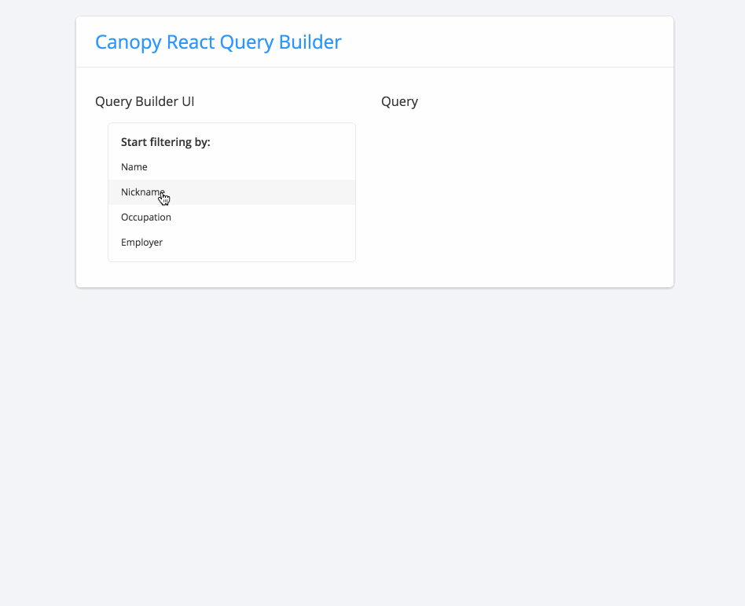

# react-query-builder

A React component for building queries/filters.



This component is intended for use with [Json-Query-Language](https://github.com/CanopyTax/Json-Query-Language), but you can define your own operators and handle them on your backend however you want.

## Example Usage

```javascript
import QueryBuilder from `react-query-builder`;

let myFilterDefs = [
  {
    field: 'name',
    label: 'Name',
    operators: [
      {
        label: 'Is',
        operator: 'eq',
        inputType: 'text',
      }
    ],
  }
];

function handleQueryChange(query) {
  // Do stuff with the query
}

<QueryBuilder filterDefs={myFilterDefs} handleQueryChange={handleQueryChange} />
```

More documentation is a WIP

## Development

1. Clone this repo
2. `cd react-query-builder`
3. `npm install`
4. `npm run watch`
5. Open `demo/index.html`

